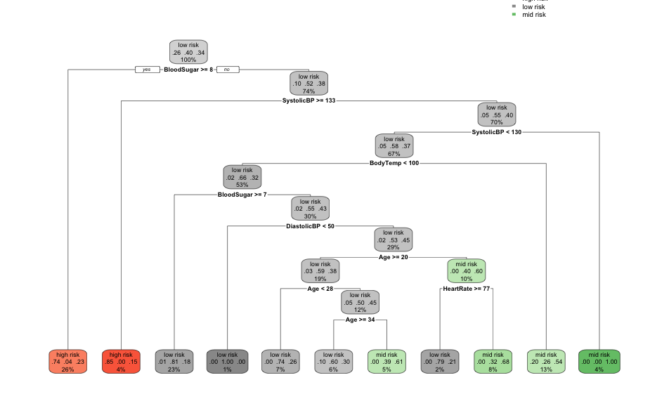

## Status: Continuing Working Document

Hi everyone. I’m continuing building my data analysis and R skills. As such, I would love feedback to better improve this project via rexmanglicmot@gmail.com. Any mistakes and misrepresentation of the data are my own.

Things Need to Do/Questions:

* provide more context on what is "maternal health risks" according to the site
* rewrite intro and cite sources 
* state objective of this project more convincingly
* provide more concepts/theory **Decision Trees** in the section
* check grammar
* get feedback and incorporate


## Introduction
Maternal health risks has increased since the medieval days. However, there is still a need to understand the underlying factors that contribute to women health including metrics such as age and blood sugar levels over various age groups.

This projects aims to learn more about such predictors by using machine learning methods such as KNN and Random Forests to see if factors can accurately predict maternal health risks.


This project is outlined in the following chapters:

1. Loading the Libraries
2. Loading the Data
3. Cleaning the Data
4. Exploratory Data Analysis
5. Modeling: K-Neighrest Neighbors
6. Modeling: Decision Trees
7. Limitations
8. Conclusion
9. Appendix
10. Inspiration for this project

A special acknowledgement to the University of Irvine's Machine Learning Repository for providing the dataset to the public.^[https://archive.ics.uci.edu/ml/datasets/Maternal+Health+Risk+Data+Set] A special acknowledgement to Marzia Ahmed from the Daffodil International University in Dhaka, Bangladesh and the rest of the coauthors for their contribution of their research dataset.^[Ahmed M., Kashem M.A., Rahman M., Khatun S. (2020) Review and Analysis of Risk Factor of Maternal Health in Remote Area Using the Internet of Things (IoT). In: Kasruddin Nasir A. et al. (eds) InECCE2019. Lecture Notes in Electrical Engineering, vol 632. Springer, Singapore.]

Based on UCI's Repository below are how each variable is measured:

1. Age: years when the women was pregnant.
2. Systolic BP (blood pressure): upper value of Blood Pressure in mmHg
3. Diastolic BP (blood pressure): lower value of Blood Pressure in mmHg
4. Blood Sugar: molar concentration, mmol/L
5. Body Temp: in Celsius
6. Heart Rate: : normal resting heart rate in beats per minute
7. Risk Level: predicted Risk Intensity Level during pregnancy considering the previous attribute (unclear, assume it is heart rate?)

## Loading the Libraries
```{r, message=FALSE}
#load libraries
library(tidyverse)
library(corrplot)
library(RColorBrewer)
library(gghalves)
#library(GGally)
library(class)
library(ggridges)
library(party)
library(partykit)
library(rpart)
library(rpart.plot)
```

## Loading the Data
```{r}
#load data
data <- read.csv('Maternal Health Risk Data Set.csv')
```

## Cleaning the Data
```{r}
#print first few rows of the data
head(data,n=10)

#Change BS to BloodSugar for better understanding
colnames(data)[4] <-'BloodSugar'

#glimpse data
glimpse(data)
```

Now, with the relevant libraries are loaded and the dataset variables are clearly understood, next steps are to clean and check for missing values, characters that are unothordox to each of the metrics via R codes below. 
```{r}
#check for  missing data in full dataset 
#difficult to do when there are lots of observations
sum(is.na(data))

#double check for missing data via different columns
#again difficult
sum(is.na(data$Age))
```
This codes above returns the dataset in which if there are no NA, FALSE will be printed in the whole dataset and the Age column. 

Let's try another method.
```{r}
#check for missing data for each variable column using sum
#output is 0 for all columns
colSums(is.na(data))
```
```{r}
#find location of missing data, if any
which(is.na(data))
```

```{r}
#get percentage of missing data in dataset
mean(is.na(data))
```
The dataset is cleaned and tidy. Next steps are to do EDA.

## Exploratory Data Analysis
```{r}
#Summary statistics of each of the variables
str(data)
```
Many of the variables except RiskLevel are factors and let's see what the distributions are using the summary function. 

```{r}
#Structure of data without the RiskLevel variable because it is a character
summary(data[-7])
```
We see different distributions based on each metric. We see that the SystolicBP and DiastolicBP are normally distributed,and thus nothing interesting to probe with these metrics. The same can also be said about bodyTemp, there is no variance between each summary statistics, further, the regular body temp is ~98 degrees. 

BloodSugar and Heartrate have interesting summary statistics, regarding the max and min, respectively. BloodSugar max value is 19, while the rest of the values are somewhat normally distributed. Heartrate has a min value of 7, while the rest of the values are also somewhat normally distributed. This means that both metrics have outliers, which skews the mean towards the outliers. Unlike HeartRate, the mean of BloodSugar is near the median indicating that the majority of the observatins are near the 6-8 value range. 

Age is interesing because the min and max are 10 and 70, respectively. Generally, as the age increases, there tends to be more complications and thus, this is a variable that I will focus on. 

But first, let's just focus on the RiskLevel variable and see what values are present and each of their count, and visualize the count via a barchart.
```{r}
#what are the of categories within Risk Level
distinct(data,RiskLevel)

#sum categories within Risk Level
data %>%
  group_by(RiskLevel) %>%
  count()

#Visualize count the number of categories within Risk Level
ggplot(data, aes(x=RiskLevel, fill=RiskLevel)) +
  geom_bar(width=.5, color ='black') +
  labs(title = 'Risk Level Bar Chart',
    x= 'Types of Risks',
    y= "Count") +
  scale_fill_brewer(palette = 'RdPu') +
  theme_bw() +
  theme(plot.title = element_text(hjust = 0.5)) +
  scale_x_discrete(limits=c('high risk', 'mid risk', 'low risk')) +
  geom_text(aes(label = ..count..), stat = "count", vjust = 1.5, 
            color = "black")
```

From the above code and bar chart we see that there are three different types of Risk Levels associated with this dataset that the author define as; high, mid, and low risks. From the bar chart above we conclude that the counts are high < mid < low. 

Now, let's focus on exploring the Age variable. 

```{r}
#Histogram of Ages
#it looks bimodal
ggplot(data, aes(Age)) +
  geom_histogram(binwidth=5, fill = 'pink', 
                 color = 'white') +
  theme_bw() +
  ggtitle('Age Distribution of Participants') +
  labs(y = 'Frequency Distribution') +
  theme(plot.title = element_text(hjust = 0.5))
```

A histogram is a means to show the frequency distribution as observations are put into designated bins.

Some insights by ,anipulating the bindwidth, I find the shape of the distribution is *bimodal* signifying that there could be two groups I could possible take a look at. The first and second peak is Age~20 and Age~50. A possible path is that I could break up the dataset into two parts based on the peaks (modes) and each art would have its own summary statistics.

But for now, let's continue with the EDA within age variable. 

```{r}
ggplot(data, aes(x=RiskLevel, y=Age, fill=RiskLevel)) +
  geom_boxplot(width=0.5,
               outlier.color='darkgreen') +
  theme_bw() +
  scale_fill_brewer(palette = 'RdPu') +
  scale_x_discrete(limits=c('high risk', 'mid risk', 'low risk')) +
  ggtitle('Age Distribution based on 
  Risk Level Category') +
  labs(y = 'Age Distribution') +
  theme(plot.title = element_text(hjust = 0.5))
```

Another way is see the distribution is via boxplot. Like the summary() function this plot shows the min, Q1, median, Q3, and max. But unlike that function, the boxplot helps us visualize the data and point out the outliers, which are not shown in the summary table, as shown as green dots here.

Some insights from this graph is that shape of the boxes and whisker lengths are almost identical between the mid and low risk categories. This means that based on this dataset's Age, it is difficult to distinguish between the two. In addition, both have outliers that are above the age, 50. The outliers skews the data, and in this case, pulls the mid and low risk categories upwards to the higher age range. The best way to visualize this is via a density plot, which we will go over in the next section.

The key insight is that of the high risk category boxplot. The "box" which contains 50% of the data is much bigger in comparison to mid and low risk. What this means is that women between the ages of roughly 22-48 could possibly lie within a high risk category of maternal risks. Extrapolating further, the median is also much higher, age~35. What this prompts is that indicating that are women in the mid thirties could possibly lie within a high risk category. This is an interesting finding. 

```{r}
ggplot(data, aes(x=RiskLevel, y=Age, fill=RiskLevel)) +
  geom_half_violin() +
  geom_half_point(alpha=0.2, color='black',
                  size=0.8, position = 'dodge') +
  scale_fill_brewer(palette = 'RdPu') +
  theme_bw() +
  labs(title = 'Half-violin and Half-scatter plots
  of Age based on Risk Level Categories') +
  theme(plot.title = element_text(hjust = 0.5))

ggplot(data, aes(x=Age, y=RiskLevel, fill=RiskLevel)) +
  geom_density_ridges_gradient() +
    scale_fill_brewer(palette = 'RdPu') +
  theme_bw() +
    labs(title = 'Ridge plots
  of Age based on Risk Level Categories') +
  theme(plot.title = element_text(hjust = 0.5))
```

To continue with the Age variable, I wanted to broaden my R skills by using different visualizations the programming language offers. To further compliment the boxplot, I wanted to use gghalves and create a half-violin and half-scatter plot. 

Now, let's move on to a tradtional appraoch to see if there are any correlations between the variables, excluding RiskLevel. One such approach is a correlation matrix that conventiently describes the data, by looking at the raw data.


```{r}
#Create data without last variable that contained chr
# -c(7) corresponds to the last variable
corrplot_data <-data[,-c(7)]

#Check to see if RiskLevel is deleted
names(corrplot_data)

#Simple Corrplot
corrplot(cor(corrplot_data), 
         col=brewer.pal(n=10, name='RdBu'),
         tl.cex = 0.8)
```

Let's do some classification, but first let's go into KNN concepts.

## Modeling: K-Nearest Neighbors


**K-Nearest Neighbors** is a distance algorithm. In short, it will classify an unknown observation (i.e., a "new data point" in the picture above), with it's known metrics, to a category based on the proximity to it's nearest neighbors.^[https://www.javatpoint.com/k-nearest-neighbor-algorithm-for-machine-learning] 

First, we set the number of K-neighbors and then the KNN model calculates the **Euclidean Distance** between the unknown data point and the aforementioned K-neighbors (see pic below) and classifies the unknown data point based on majority. 


For example, suppose we have 2 Categories (A and B) and an unknown observation, and we want to know what classification it would be. Suppose we set k=5, then the model will look at the **5 nearest neighbors** and determine the unknown observation based on the classification of those 5 nearest neighbors. (see pic below)


We will do this classification with our dataset. We will split into the traditional 80/20 split that will split 80% of the data into the training set and 20% of the data into the testing set. (It is important to note that we never want to train with our testing data.) 

Let's review the structure and make a copy of the original dataset as we move forward. 
```{r}
#see structure of the dataset
str(data)

#make a copy of the original dataset
data2 <-data
```
We see that dependent variable, RiskLevel, is a character and for purposes of KNN, RiskLevel needs to converted into a factor. 

```{r}
#convert the RiskLevel column, our target, into a factor
data2$RiskLevel <- as.factor(data2$RiskLevel)
```

Now we need to normalize the 6 remaining variables, but first in order to be more efficient, let's write a function that will iterate over each variable column instead of assigned values within a variable to an object and piecing it together in another dataframe. Again, we are not interested in the RiskLevel, so I will disregard that variable column when I code the lapply. 
```{r}
#need to normalize data with a range between 0 and 1
#create a function to iterate for each variable column
data_norm <- function (x) {
  ((x-min(x))/ (max(x)- min(x)))
}

#create the normalize data
#lapply will iterate over each of the variables and store it into a 
#dataframe object except for target variable, RiskLevel
data3 <- as.data.frame(lapply(data2[,-7], data_norm))
```

Let's compare the the summary statistics of data2 (pre-normalization) to data3 (post-normalization). 
```{r}
#check to see if ALL values range from 0 to 1
#important to do this before doing KNN
summary(data2[-7])
```


```{r}
summary(data3)
```
data 3 is normalized and ready to go into the KNN model. 

Let's do a pre-check when splitting the data into a 80/20 split before actually doing the split. 
```{r}
#create split concept
a <- .8*1014
b <- .2*1014
a+b
811+203
```
Great! Both the test and train dataframes have the same number of observations as in the original dataframe.

Let's split the data and create the model.

```{r}
#create 80/20 split for testing and training set based on the rows
data3_train <- data3[1:811, ]
data3_test <- data3[812:1014, ]

#create the prediction model
data3_pred <- knn(
  data3_train,
  data3_test,
  #create training labels but labels are present in data2 and on RiskLevel,
  #which is column 7
  data2[1:811,7],
  #need to specify value of K
  #general rule of thumb is sq.rt. of 1014 is 31-ish
  k=31)

#validate pred labels with the actual labels on the RiskLevel, which is column 7
table_knn <- table(Predicted = data3_pred, Actual = data2[812:1014,7])

#view table
table_knn
```
In the table above, the model predicted for each classification:

* High Risk: 41 correct out of 100 = 41% correct
* Low Risk: 47 correct out of 78 =  60% correct
* Mid Risk: 38 correct out of 66 = 58% correct

This is not good!

Let's calculate the model's miscalculation error nonetheless.
```{r}
#Calculate error
1-sum(diag(table_knn))/sum(table_knn)
```

The miscalculation error is 38%, meaning the **accuracy of entire KNN model is 62%**. This is not optimal.

Perhaps KNN is not the best model for classification of this dataset. 

Let's try another classification model, Decision Trees.

## Modeling: Decision Trees


A **Decision Tree**  is an algorithm that starts from the Root Node. It compares values of root attributes with real data  tree-like flowchart that is used to decide how to classify an observation. 


With every decision there will be a "yes/no" and branch out to the next node and will continue to do so until all the metrics are used. Thus, similar to KNN we will use the metrics to predict the classification a person is one of the 3 RiskLevel types.
```{r}
#set seed for replcation and also no need to normalize the data
set.seed(123)

#split the data
#recall that the dependent variable needs to be a factor, 
#not a chracter so need to use data2 because it is already converted. 
data_dt <- sample(2, nrow(data2), replace= TRUE, prob= c(0.8, 0.2))
data_dt_train <-data2[data_dt==1, ]
data_dt_test <-data2[data_dt==2, ]

#create the decision tree model
#RiskLevel is the dependent variable such that we want to predict
#recall that the "." means everything, so in this case it means all the the variables, 6 total. Using train data
tree <- ctree(RiskLevel~., data_dt_train)
```


```{r, eval= FALSE}
#the output for the two codes is shown but not executed because
#the plots are not clear.
#Both show the same info, I screened shot the plot(tree) below

#print tree and it has 27 nodes
print(tree)

#plot the tree
plot(tree)
```


In RStudio, this plot renders normal, but does not in GitHub. The plot tends to scrunch up and not give the best quality.

Thus, the Decision Tree Plot above is a screen shot and is also available within this repository. 

```{r}
#use the model on the test data
tree_test_results <- predict(tree, data_dt_test)

#put results into a confusion matrix
table_tree <- table(Predicted= tree_test_results, Acutal= data_dt_test$RiskLevel)

#see the results
table_tree
```
In the table above, the model predicted for each classification:

* High Risk: 51 correct out of 61 = 84% correct
* Low Risk: 72 correct out of 83 =  87% correct
* Mid Risk: 19 correct out of 56 = 34% correct

For High and Low Risk classification, the Decision Tree model did fairly well! Not so with Mid Risk classification.

Let's calculate the model's miscalculation error nonetheless.

```{r}
#Calculate error
1-sum(diag(table_tree))/sum(table_tree)

```

The miscalculation error is 31%, meaning the **accuracy of the Decision Tree model is 78%**.

This model is did okay. Perhaps, another classification model would be better.

## Limitations


## Conclusion
I will finish this part when the above sections are completed. 

## Appendix (Random Plots)
```{r}
#Scatterplot for Age and BS
#Not much of a relationship
ggplot(data, aes(Age, BloodSugar)) +
  geom_point(color='lightpink') +
  geom_smooth() +
  theme_bw()
```

The below plot is of the same decision tree above, but with **colors**. The Decision Tree Plot Color.png is also available within this repository. 
```{r, eval= FALSE}
#the output for the two codes is shown but not executed because
#the plots are not clear.

#lets try another plotting format
#tree2 <-rpart(RiskLevel~., data_dt_train)
#rpart.plot(tree2)
```



## Inspiration for this project

